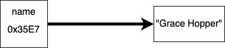
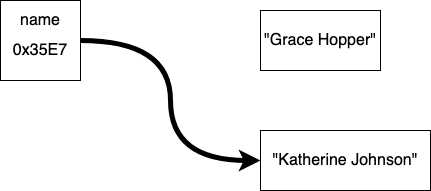
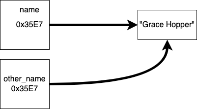
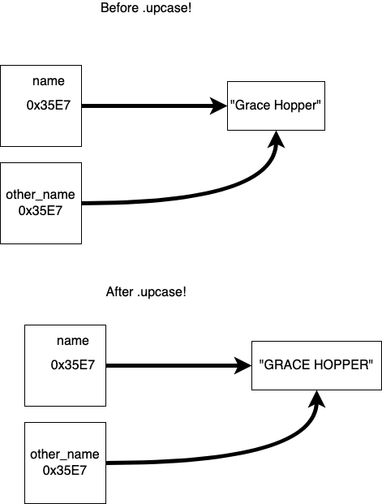

# Assignment Statements


Understanding how to read and use assignment statements is a critical skill in programming

### Reading Assignment Statements

* Assignment statements are read from right-to-left, not from left-to-right
* Use phrases like _assigns_, or _stores the value_, instead of _equals_, or _equal to_

```ruby
# the value of 5 is assigned to the variable named x
x = 5
# the current value of x(5) is added with 1
# that sum is then assigned to the variable named x
x = x + 1
```

```ruby
# the value of 1 is assigned to the variable named x
x = 1
# the value stored in x(1) is assigned to y
# note: this does not mean that x and y will always
# store the same value
y = x
```

#### Practice Reading and Evaluating

1. What is the value of x, after the following code is executed?

	```ruby
	x = 2
	x = x + 3
	x = x * 2
	```

2. What are the values of x, and y, after the following code is executed?

	```ruby
	x = 3
	y = x
	x = x - 7
	y = y - 1
	```

### Compound Assignment Statements

To make your code shorter, you can used compound assignment statements. These only work if the variable on the left-side of the statement has a value other than `nil`

| Compound Statement | Long-form statement |
| :----------------- | :------------------ |
| `x += 3`           | `x = x + 3`         |
| `x -= 4`           | `x = x - 4`         |
| `x /= 2`           | `x = x / 2`         |
| `x *= 8`           | `x = x * 8`         |

### Pass by Reference

In Ruby, and many programming languages variables can be thought of as references.  A variable holds the memory address of the value stored in memory.  For example for the code:

```ruby
name = "Grace Hopper"
```

Can be represented like this:




When you make the statement

```ruby
name = "Katherine Johnson"
```

The reference is changed to:



When you use the assignment or compound assignment operator in Ruby you change the value a variable refers.

Further when you assign two different objects like arrays, strings or hashes to the same value, both variables point to the same place in memory.

```ruby
name = "Grace Hopper"
other_name = name
```



This is important because on objects like strings, hashes and arrays, when you use the `.` operator Ruby follows the reference (arrow) to the object and can make changes to the value at that location.

```ruby
name = "Grace Hopper"
other_name = name

name.upcase!

puts name       # GRACE HOPPER
puts other_name # GRACE HOPPER
```



Similarly if two variables refer to the same hash or array, changing an element in one object will be reflected in the other.

```ruby
list = ["Peter", "Paul", "Mary"]
other_list = list

other_list[1] = "Ida"

puts "#{list}"    # ["Peter", "Ida", "Mary"]
```

### Resources

- [Ada Assignment Statements Video](https://adaacademy.hosted.panopto.com/Panopto/Pages/Viewer.aspx?id=7d4167a7-8bc9-4d38-b58a-0cf78392cc2b) (11:09)