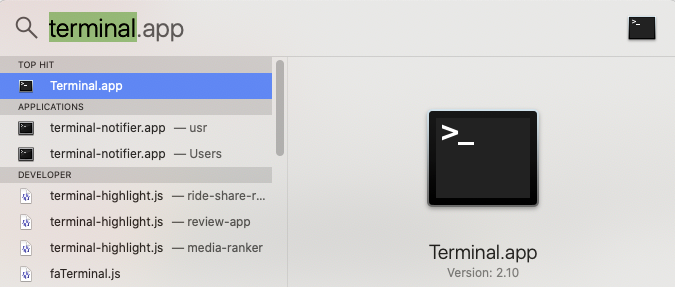
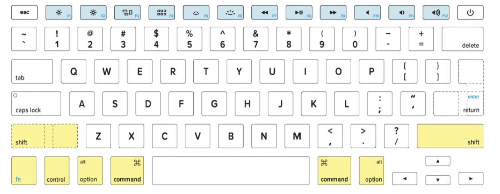
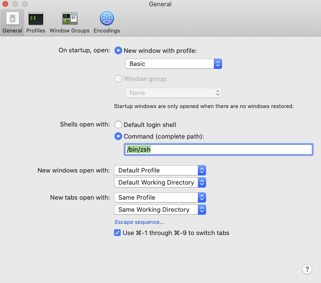

# Programming Workflow

## MacOS Screen Setup

It's very helpful to split your screen when writing code with one half of the screen consisting of your editor and the other the terminal or browser.  This way you can go back and forth between the editor and terminal with minimal disruption. 

<iframe src="https://adaacademy.hosted.panopto.com/Panopto/Pages/Embed.aspx?id=d9dba6a8-04d8-4161-8950-abd6002cb7c7&autoplay=false&offerviewer=true&showtitle=true&showbrand=false&start=0&interactivity=all" width=720 height=405 style="border: 1px solid #464646;" allowfullscreen allow="autoplay"></iframe>

There are a number of tools available to help you split your screen including:

* [MacOS Split Desktops](https://www.digitaltrends.com/computing/how-to-use-split-view-on-a-mac/)
* Install [Rectangle](https://rectangleapp.com/) - Free
* Install [Moom App](https://manytricks.com/moom/) - $10

## Terminal

<iframe src="https://adaacademy.hosted.panopto.com/Panopto/Pages/Embed.aspx?id=2cdaf784-ea88-4e27-872f-abd6002f4863&autoplay=false&offerviewer=true&showtitle=true&showbrand=false&start=0&interactivity=all" width=720 height=405 style="border: 1px solid #464646;" allowfullscreen allow="autoplay"></iframe>

As web developers we regularly use the terminal to run, edit, test and debug our applications.  As such it's important to get familiar with using the MacOS terminal. 

To launch terminal hit <kbd>cmd</kbd> + <kbd>spacebar</kbd> and then type terminal.  



You can also add the terminal application to your dock, by right-clicking on the application. 


There are a variety of keyboard combinations and commands you can use when using the terminal.

You can even write programs to automate the terminal and thus the operating system, which is called **shell programming**.  

### The Mac Keyboard

Macs have a number of special keys which are a little different from Windows.  You can read more about it on [keyshorts.com](https://keyshorts.com/blogs/blog/41999105-the-ultimate-guide-to-macbook-keyboard).  The control, alt/option and command keys are used for a variety of shortcuts in the terminal.



#### Terminal Shortcuts

| Command                             | Description                                                                                         |
| :---------------------------------- | :-------------------------------------------------------------------------------------------------- |
| <kbd>cmd</kbd> + <kbd>k</kbd>       | clear your screen                                                                                   |
| `touch <filename>`                  | creates a new file named filename                                                                   |
| `pwd`                               | <b>p</b>rints the <b>w</b>orking <b>d</b>irectory (displays the full path of the current directory) |
| `cd`                                | <b>c</b>change <b>d</b>irectory                                                                     |
| `cd ..`                             | go back a directory                                                                                 |
| `cd ~`                              | choose home directory                                                                               |
| `ls`                                | list the items in the directory                                                                     |
| `ls -a`                             | list the items in the directory, including hidden files                                             |
| `mkdir <dirname>`                   | make a new directory                                                                                |
| `rm <filename>`                     | removes the file named filename                                                                     |
| `rm -r <dirname>`                   | removes the directory named dirname (and everything in it)                                          |
| <kbd>&#8593;</kbd>                  | view the previous command                                                                           |
| <kbd>ctrl</kbd> + <kbd>a</kbd>      | go to beginning of line                                                                             |
| <kbd>ctrl</kbd> + <kbd>e</kbd>      | go to end of line                                                                                   |
| <kbd>alt</kbd> + <kbd>&#8594;</kbd> | move to the right, one word                                                                         |
| <kbd>alt</kbd> + <kbd>&#8592;</kbd> | move to the left, one word                                                                          |
| <kbd>ctrl</kbd> + <kbd>c</kbd>      | interrupt/stop a command                                                                            |

### IRB - Interactive Ruby

IRB is a terminal-based tool where you can run Ruby commands and see the results immediately.  It's great for experimenting with Ruby commands.  

<iframe src="https://adaacademy.hosted.panopto.com/Panopto/Pages/Embed.aspx?id=8fdf1e1d-c8e1-40d7-a639-abd60032162e&autoplay=false&offerviewer=true&showtitle=true&showbrand=false&start=0&interactivity=all" width=720 height=405 style="border: 1px solid #464646;" allowfullscreen allow="autoplay"></iframe>

There are a few shortcut commands that are helpful to know.

#### irb commands

| Command                                  | Description                    |
| :--------------------------------------- | :----------------------------- |
| `irb`                                    | start interactive ruby session |
| `exit` or <kbd>ctrl</kbd> + <kbd>d</kbd> | exit an `irb` session          |
| <kbd>ctrl</kbd> + <kbd>c</kbd>           | interrupt/stop a command       |

### Running Ruby Files

You can run Ruby files from the terminal by typing `ruby` followed by the name of the file.  

For example if you have a file named, `example_file.rb`, you could run the file from the terminal with the following.

```bash
$ ruby example_file.rb
```


### VS Code

<iframe src="https://adaacademy.hosted.panopto.com/Panopto/Pages/Embed.aspx?id=9e5ed912-4961-49ed-b03a-abd60034e1b7&autoplay=false&offerviewer=true&showtitle=true&showbrand=false&start=0&interactivity=all" width=720 height=405 style="border: 1px solid #464646;" allowfullscreen allow="autoplay"></iframe>

* If [VS Code](https://code.visualstudio.com/) is a very extensible open-source editor which supports a variety of languages including Ruby, Python, and JavaScript.  
* In VS Code, type `shift-command-p` and type **shell command to install the terminal shell command**.
  * This only needs to be done once to allow you to launch VS code from the terminal
* Now, to launch VS Code from terminal, type `code` followed by the file name or directory name

#### VS Code Extensions

VS Code also come with a number of extensions which you can install to provide new or different functionality.  Some of the recommended exentsions include:

*  [Live Share](https://marketplace.visualstudio.com/items?itemName=MS-vsliveshare.vsliveshare) - A way to collaborate on source code like Google Docs.
*  [Markdown All in One](https://marketplace.visualstudio.com/items?itemName=yzhang.markdown-all-in-one) - An extension to help writing markdown files
*  [Ruby](https://marketplace.visualstudio.com/items?itemName=rebornix.Ruby) - The standard Ruby extension to provide syntax highlighting and intellisense.
*  [VS Code Ruby](https://marketplace.visualstudio.com/items?itemName=wingrunr21.vscode-ruby) - Another nice VS code Ruby Extension
*  [ERB Extention](https://marketplace.visualstudio.com/items?itemName=CraigMaslowski.erb) - An extension used with Rails
*  [ESLint](https://marketplace.visualstudio.com/items?itemName=dbaeumer.vscode-eslint) - A JavaScript extension for syntax highlighting

You are welcome to experiment with a variety of plugins for VS Code.

## Customizing Your Shell - Optional

### Setting zsh as the default shell

A shell is a set of commands and user interface for controlling an operating system via the terminal.  With newly purchased Macs the default shell is zsh, while older macs use an older version of the Bash shell.

You can read more about [zsh vs bash](https://dev.to/jasmin/a-brief-difference-between-zsh-and-bash-5ebp) if you are interested.  

To set your shell to zsh first start terminal and then go to preferences.


Then set the **Shells open with:** to `/bin/zsh`.



### Oh My Zsh

Zsh is very customizable environent in zsh and there's a great community-driven framework for managing zsh configurations providing thousands of helper functions, plugins and themes.  Basically it lets you customize the look and feel of the terminal and add custom commands and shortcuts.  The most amazing thing is that **it comes with git integration!**

Using **Oh My Zsh** is completely optional at Ada, but it can be handy for it's support of git and extensibility.  You are welcome to install it if you are interested.

You can install it with:

```zsh
sh -c "$(curl -fsSL https://raw.github.com/robbyrussell/oh-my-zsh/master/tools/install.sh)"
```

You can read more about it on the [oh my zsh homepage](https://ohmyz.sh/).

