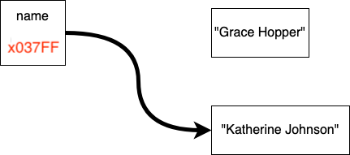
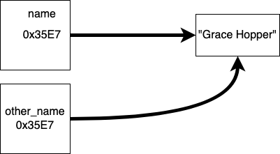
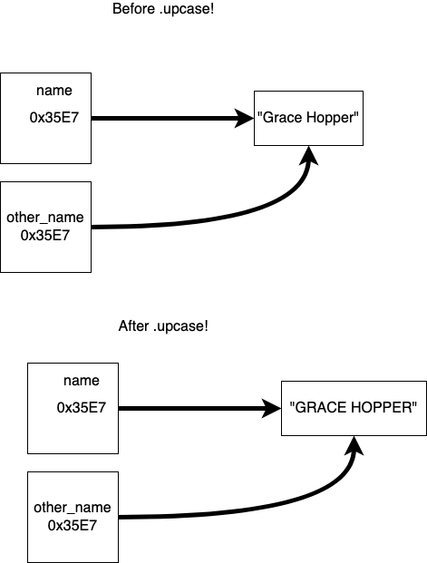

# Assignment Statements


Understanding how to read and use assignment statements is a critical skill in programming.

<iframe src="https://adaacademy.hosted.panopto.com/Panopto/Pages/Embed.aspx?id=7d4167a7-8bc9-4d38-b58a-0cf78392cc2b&autoplay=false&offerviewer=true&showtitle=true&showbrand=false&start=0&interactivity=all" style="width: 720px; height: 405px; border: 1px solid #464646;" allowfullscreen allow="autoplay"></iframe>

## Reading Assignment Statements

* Assignments should be read as "give the variable x the value 5" or "set x to 5".
* Use phrases like _assigns_, or _stores the value_, instead of _equals_, or _equal to_

```ruby
# the value of 5 is assigned to the variable named x
x = 5
# the current value of x(5) is added with 1
# that sum is then assigned to the variable named x
x = x + 1
```

```ruby
# the value of 1 is assigned to the variable named x
x = 1
# the value stored in x(1) is assigned to y
# note: this does not mean that x and y will always
# store the same value
y = x
```

### Practice Reading and Evaluating

<!-- >>>>>>>>>>>>>>>>>>>>>> BEGIN CHALLENGE >>>>>>>>>>>>>>>>>>>>>> -->
<!-- Replace everything in square brackets [] and remove brackets  -->

### !challenge

* type: short-answer
* id: c5b8be0e-17df-4546-b80f-6b9593a47815
* title: Assignment Statement Question 1
* points: 1
* topics: assignment statement

##### !question

What is the value of `x`, after the following code is executed?

```ruby
x = 3
y = x
x = x - 7
y = y - 1
```

##### !end-question

##### !placeholder


##### !end-placeholder

##### !answer

-4

##### !end-answer

<!-- other optional sections -->
##### !hint

Look at lines 1 and 3.

##### !end-hint

<!-- !rubric - !end-rubric (markdown, instructors can see while scoring a checkpoint) -->
##### !explanation

3 minus 7 is -4

##### !end-explanation

### !end-challenge

<!-- ======================= END CHALLENGE ======================= -->

<!-- >>>>>>>>>>>>>>>>>>>>>> BEGIN CHALLENGE >>>>>>>>>>>>>>>>>>>>>> -->
<!-- Replace everything in square brackets [] and remove brackets  -->

### !challenge

* type: short-answer
* id: 25642e8f-e5ac-415d-ba59-bd1017e8dc3a
* title: Assignment Statement 2
* points: 1
* topics: assignment statement

##### !question

 What is the value of `y`, after the following code is executed?

```ruby
x = 3
y = x
x = x - 7
y = y - 1
```

##### !end-question

##### !placeholder


##### !end-placeholder

##### !answer

2

##### !end-answer

<!-- other optional sections -->
##### !hint

So `y` is assigned to 3 and then what do you do to `y`?

##### !end-hint
<!-- !rubric - !end-rubric (markdown, instructors can see while scoring a checkpoint) -->
##### !explanation 

3 minus 1 is 2

##### !end-explanation

### !end-challenge

<!-- ======================= END CHALLENGE ======================= -->


## Compound Assignment Statements

To make your code shorter, you can used compound assignment statements. These only work if the variable on the left-side of the statement has a value other than `nil`

| Compound Statement | Long-form statement |
| :----------------- | :------------------ |
| `x += 3`           | `x = x + 3`         |
| `x -= 4`           | `x = x - 4`         |
| `x /= 2`           | `x = x / 2`         |
| `x *= 8`           | `x = x * 8`         |

## Pass by Reference

In Ruby, and many programming languages variables can be thought of as references.  A variable holds the memory address of the value stored in memory.  For example for the code:

```ruby
name = "Grace Hopper"
```

Can be represented like this:


When you make the statement

```ruby
name = "Katherine Johnson"
```

The reference is changed to:



When you use the assignment or compound assignment operator in Ruby you change the variable to point toward a different address in memory.

Further when you assign two different objects like arrays, strings or hashes to the same value, both variables point to the same place in memory.

```ruby
name = "Grace Hopper"
other_name = name
```



This is important because on objects like strings, and later hashes and arrays, when you use the `.` operator Ruby follows the reference (arrow) to the object and can make changes to the value at that location.

```ruby
name = "Grace Hopper"
other_name = name

name.upcase!

puts name       # GRACE HOPPER
puts other_name # GRACE HOPPER
```



In the code above the `upcase!` method went to the memory address indicated by `name` and `other_name` and then changed every character at that location to an uppercase letter.  This method changes, or mutates the values at that address.  So it is often called a _mutator_ method.  It's convention in Ruby to name methods with an `!` character if they change the data stored at the memory address, to give a hint to what they do.

Similarly if two variables refer to the same hash or array, changing an element in one object will be reflected in the other.  We will see this in later units.

```ruby
list = ["Peter", "Paul", "Mary"]
other_list = list

other_list[1] = "Ida"

puts "#{list}"    # ["Peter", "Ida", "Mary"]
```

<!-- >>>>>>>>>>>>>>>>>>>>>> BEGIN CHALLENGE >>>>>>>>>>>>>>>>>>>>>> -->
<!-- Replace everything in square brackets [] and remove brackets  -->

## !challenge

* type: multiple-choice
* id: 0c7d1b98-583b-4800-ade8-e1d426b76681
* title: References and values
* points: 1
* topics: assignment

##### !question

What will the following output?

```ruby
name = "Great Gatsby"
other_name = name

name.swapcase!

puts other_name
```

##### !end-question

##### !options

* Great Gatsby
* gREAT gATSBY
* great gatsby
* GREAT GATSBY

##### !end-options

##### !answer

* gREAT gATSBY

##### !end-answer

<!-- other optional sections -->
##### !hint 

swapcase will convert all capital letters to lower case and all lower-case letters to capital letters.

##### !end-hint
<!-- !rubric - !end-rubric (markdown, instructors can see while scoring a checkpoint) -->
##### !explanation

Both variables refer to the same string in memory.  `.swapcase!` will convert all the capital letters to lower case and lower case letters to capital letters.  Since both variables refer to the same string in memory both will reflect the changes.

##### !end-explanation

### !end-challenge

<!-- ======================= END CHALLENGE ======================= -->

## Resources

- [Ada Assignment Statements Video](https://adaacademy.hosted.panopto.com/Panopto/Pages/Viewer.aspx?id=7d4167a7-8bc9-4d38-b58a-0cf78392cc2b) (11:09)
