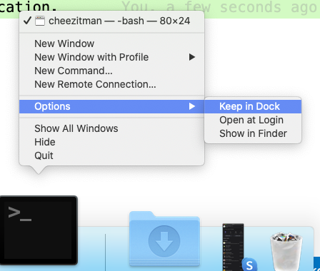

# Programming Workflow

## MacOS Screen Setup

It's very helpful to split your screen when writing code with one half of the screen consisting of your editor and the other the terminal or browser.  This way you can go back and forth between the editor and terminal with minimal disruption. 

### TODO - Video on split screen

There are a number of tools available to help you split your screen including:

* [MacOS Split Desktops](https://www.digitaltrends.com/computing/how-to-use-split-view-on-a-mac/)
* Install [Rectangle](https://rectangleapp.com/) - Free
* Install [Moom App](https://manytricks.com/moom/) - $10

## Terminal

### TODO - Video on Terminal

As web developers we regularly use the terminal to run, edit, test and debug our applications.  As such it's important to get familiar with using the MacOS terminal. 

To launch terminal hit `cmd-spacebar` and then type terminal.  


You can also add the terminal application to your dock, by right-clicking on the application. 



There are a variety of keyboard combinations and commands you can use when using the terminal.

#### Terminal Shortcuts

| Command            | Description                                                                                         |
| :----------------- | :-------------------------------------------------------------------------------------------------- |
| `cmd` + `K`        | clear your screen                                                                                   |
| `touch <filename>` | creates a new file named filename                                                                   |
| `pwd`              | <b>p</b>rints the <b>w</b>orking <b>d</b>irectory (displays the full path of the current directory) |
| `cd`               | <b>c</b>hoose a <b>d</b>irectory                                                                    |
| `cd ..`            | go back a directory                                                                                 |
| `cd ~`             | choose home directory                                                                               |
| `ls`               | list the items in the directory                                                                     |
| `ls -a`            | list the items in the directory, including hidden files                                             |
| `mkdir`            | make a new directory                                                                                |
| `rm <filename>`    | removes the file named filename                                                                     |
| `rm -r <dirname>`  | removes the directory (and everything in it) named dirname                                          |
| &#8593;            | view the previous command                                                                           |
| `ctrl` + `a`       | go to beginning of line                                                                             |
| `ctrl` + `e`       | go to end of line                                                                                   |
| `alt` + &#8594;    | move to the right, one word                                                                         |
| `alt` + &#8592;    | move to the left, one word                                                                          |
| `ctrl` + `c`       | interrupt or stop a command                                                                         |

### IRB - Interactive Ruby

IRB is a terminal-based tool where you can run Ruby commands and see the results immediately.  It's great for experimenting with Ruby commands.  

There are a few shortcut commands that are helpful to know.

## TODO - Make IRB video (30 seconds)

#### irb commands

| Command      | Description                    |
| :----------- | :----------------------------- |
| `irb`        | start interactive ruby session |
| `exit`       | exit an `irb` session          |
| `ctrl` + `c` | interrupt or stop a command    |

### Running Ruby Files

You can run Ruby files from the terminal by typing `ruby` followed by the name of the file.  

## TODO - Make ruby running video (30 seconds)

### VS Code

## TODO - Setup Video on VS Code

* If [VS Code](https://code.visualstudio.com/) is a very extensible open-source editor which supports a variety of languages including Ruby, Python, and JavaScript.  
* In VS Code, type `shift-command-p` and type shell command to install the terminal shell command.
* Now, to launch VS Code from terminal, type `code` followed by the file name or directory name

## Customizing Your Shell - Optional

### Setting zsh as the default shell

A shell is a set of commands and user interface for running a computer via the terminal.  With newly purchased Macs the default shell is zsh, while older macs use an older version of the Bash shell.

With newly purchased Macs the default shell is zsh, while older macs use an older version of the Bash.  You can read more about [zsh vs bash](https://dev.to/jasmin/a-brief-difference-between-zsh-and-bash-5ebp) if you are interested.  

To set your shell to zsh first start terminal and then go to preferences.

[set terminal preferences](images/terminal-preferences.png)

Then set the **Shells open with:** to `/bin/zsh`.

[set default shell to zsh](set-default-shell.png)

### Oh My Zsh

Zsh is very customizable and there's a great community-driven framework for managing zsh configurations and provides thousands of helper functions, plugins and themes.  The most amazing thing is that **it comes with git integration!**

You can install it with:

```zsh
sh -c "$(curl -fsSL https://raw.github.com/robbyrussell/oh-my-zsh/master/tools/install.sh)"
```

You can read more about it on the [oh my zsh homepage](https://ohmyz.sh/).

