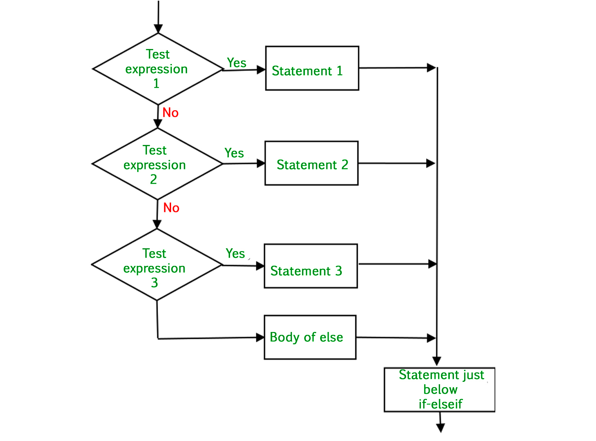

# Conditionals

Conditionals are a programming construct that will allow you to control the flow of a program through branching (they allow your program to make decisions).

<iframe src="https://adaacademy.hosted.panopto.com/Panopto/Pages/Embed.aspx?id=22e94763-7a38-4237-a39b-96154f090cbf&autoplay=false&offerviewer=true&showtitle=true&showbrand=false&start=0&interactivity=all" style="width: 720px; height: 405px; border: 1px solid #464646;" allowfullscreen allow="autoplay"></iframe>

## Terms

* **Conditional** -  An expression that evaluates to a truthy or falsy value
  * Typically a conditional expression just evalutes to true or false
  * For example `age < 21` evaluates to `true` when `age` is 20 and `false` when `age` is 21
* **Truthy** - Any value in Ruby which is neither `false`, or `nil`
* **Falsy** - Either `false` or `nil`

```ruby
if x < 3
  # This code runs if the condition above is true
  puts "x is less than 3"
end
```

An if statement is made of the keyword `if` a boolean conditional like `x < 3` and then code to run when that condition is true.

The flow of the program would look like this:


## `if`/`elsif`/`else` Statements

`elsif` and `else` statements can only be used when paired with an if

```ruby
# independent tests; not exclusive
# 0, 1, or many of the statement(s) may execute
# every test in every if block is checked
if test
  statement(s)
end
if test
  statement(s)
end
if test
  statement(s)
end
```

```ruby
# 0, or 1 of the if blocks may execute
# at most only 1 of the if blocks execute
# it could be the case that 0 if blocks execute because their is no else
if test
  statement(s)
elsif test 
  statement(s)
elsif test
  statement(s)
end
```

```ruby
# mutually exclusive
# exactly 1 of the if blocks will execute
if test
  statement(s)
elsif test
  statement(s)
else
  statement(s)
end
```

So for example we could write:

```ruby
puts "How old are you?" 
age = gets.chomp.to_f

if age >= 21
  puts "Have a drink!"
elsif age >= 18
  puts "You can't drink but have you voted yet?"
elsif age >= 16
  puts "Would you consider being our designated driver?"
else 
  puts "Would you like some milk?
end
```

If you user enters 35, they will get "Have a drink!", if they enter 19, the program will output "You can't drink but have you voted yet?", and if they put a number less than 16, they will get "Would you like some milk?"  This lets our programs do different things for different values.

You can also picture it with the following diagram.



## Postfix Conditional

A way to shorten your code, when you only have one test to perform.

```ruby
name = gets.chomp
puts "You're rad!" if name == "Issa" 
```

```ruby
drink = gets.chomp
puts "Drink more water!" unless drink == "water"
```

## Case Statements

* A good option when you are wanting to test a number of exact matches on a single variable

```ruby
grade = gets.chomp
case grade
  when "A"
    puts "Good job"
  when "B"
    puts "Okay job"
  when "C"
    puts "You did a job"
  when "D"
    puts "You might have to do the job again"
  when "E"
    puts "You have to do the job again"
end
```

```ruby
grade = gets.chomp
case grade
  when "A", "B", "C"
    puts "You passed"
  when "D"
    puts "You barely passed"
  when "E"
    puts "You did not pass"
end
```

## Practice Problems

<!-- >>>>>>>>>>>>>>>>>>>>>> BEGIN CHALLENGE >>>>>>>>>>>>>>>>>>>>>> -->
<!-- Replace everything in square brackets [] and remove brackets  -->

### !challenge

* type: multiple-choice
* id: a916bdf6-4e83-4f41-8e77-f01f5d390aff
* title: What is the boolean expression in the code below?
* topics: conditionals

##### !question

What is the boolean expression in the code below?

  ```ruby
  test_score = gets.chomp.to_i

  if test_score > 90
    print "You got an A!"
  end
  ```

##### !end-question

##### !options

* `test_score > 90`
* `print "You got an A!"`
* `test_score = gets.chomp.to_i`

##### !end-options

##### !answer

* `test_score > 90`

##### !end-answer

<!-- other optional sections -->
##### !hint

A conditional is a statement which evaluates to `true` or `false`.

##### !end-hint
<!-- !rubric - !end-rubric (markdown, instructors can see while scoring a checkpoint) -->
##### !explanation

The conditional goes inside the `if` statement and `test_score > 90` will evaluate to `true` if `test_score` is greater than 90, and false otherwise.

##### !end-explanation

### !end-challenge

<!-- ======================= END CHALLENGE ======================= -->

<!-- >>>>>>>>>>>>>>>>>>>>>> BEGIN CHALLENGE >>>>>>>>>>>>>>>>>>>>>> -->
<!-- Replace everything in square brackets [] and remove brackets  -->

### !challenge

* type: multiple-choice
* id: 5e4a8450-d7d0-4758-8eb8-599fcf7be99e
* title: When a conditional evaluates to true
<!-- * points: [1] (optional, the number of points for scoring as a checkpoint) -->
* topics: conditionals

##### !question

Provide a value of `test_score` that will cause the code to print `You got an A!`

  ```ruby
  test_score = gets.chomp.to_i

  if test_score > 90
    print "You got an A!"
  end
  ```
##### !end-question

##### !options

* `90`
* `"taco"`
* `89`
* `91`

##### !end-options

##### !answer

* `91`

##### !end-answer

<!-- other optional sections -->
##### !hint

`>` means "greater than", not "greater than or equal to"

##### !end-hint
<!-- !rubric - !end-rubric (markdown, instructors can see while scoring a checkpoint) -->
##### !explanation

`91` is the only value in the list that is greater than `90`.  `90` is instead equal to but not greater than itself.

##### !end-explanation

### !end-challenge

<!-- ======================= END CHALLENGE ======================= -->

<!-- >>>>>>>>>>>>>>>>>>>>>> BEGIN CHALLENGE >>>>>>>>>>>>>>>>>>>>>> -->
<!-- Replace everything in square brackets [] and remove brackets  -->

### !challenge

* type: multiple-choice
* id: 5e741311-5375-40d9-b388-ee90e0c37be3
* title: Provide a value which will cause nothing to be printed
<!-- * points: [1] (optional, the number of points for scoring as a checkpoint) -->
* topics: conditionals

##### !question

Provide a value of `test_score` that will cause the code to not print anything

  ```ruby
  test_score = gets.chomp.to_i

  if test_score > 90
    print "You got an A!"
  end
  ```

##### !end-question

##### !options

* `91`
* `100`
* `90`

##### !end-options

##### !answer

* `90`

##### !end-answer

<!-- other optional sections -->
##### !hint

`>` means "greater than"

##### !end-hint
<!-- !rubric - !end-rubric (markdown, instructors can see while scoring a checkpoint) -->
##### !explanation

`90` is the only value which is not greater than `90`.

##### !end-explanation

### !end-challenge

<!-- ======================= END CHALLENGE ======================= -->

## Resources

* [Ada Conditionals Video](https://adaacademy.hosted.panopto.com/Panopto/Pages/Viewer.aspx?id=22e94763-7a38-4237-a39b-96154f090cbf) (14:21)
