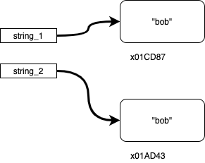
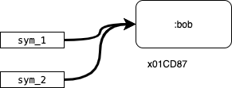

# Symbols

## Overview

* Symbols in Ruby are objects with specific names
* There can only ever be one symbol with the same name in a program's execution
* If you are naming something, you should use a symbol
* If the contents of the individual characters are important than you should use a string

## What Are Symbols?

Symbols are a type of variable, like a String, Integer or Boolean.  A symbol is just a name and an internal ID.  We can indicate a symbol literal (the value of a symbol) with text preceeded by a colon.  For example `:alice` is a symbol value, we can make variables and assign them to symbols like:  `name = :shelan`


They're useful because if you have a symbol `:this_is_a_symbol`, any symbol variable with that value all refer to the same memory location.  

For example if you have this:

```ruby
puts "enter a name"
string_1 = gets.chomp
puts "enter the same name"
string_2 = gets.chomp
```

Then if the user enters "bob" for both prompts, you will have two string variable, each holding "bob," but storing them in different spots in memory.



However if you have them converted into symbols like this:

```ruby
puts "enter a name"
sym_1 = gets.chomp.to_sym
puts "enter the same name"
sym_1 = gets.chomp.to_sym
```

You end up with:



So each symbol in memory is unique, you'll never waste space storing two symbols with the same value.  Neat!

## Syntax

As noted a symbol literal starts with a colon, otherwise it looks like a string without the quotes.

```ruby
:age # creates a symbol named age
```

## Convert string to symbol

Any string literal can be converted to a symbol with the `.to_sym` method.

```ruby
"apple".to_sym # creates an :apple symbol
```

## Symbols and Hashes

We'll learn to use symbols with hashes later in this unit.  Because symbol values are unique in memory, they make efficient keys for a hash.  This is an example we'll come back to later.

```ruby
# red, blue, yellow, and purple are all symbols
# when initializing a hash, you do not need the preceding :
colors = {red: 32, blue: 13, yellow: 2, purple: 104}

# when accessing, you do need the :
puts "#{colors[:red] people love red"
```

Notice the colon in `colors[:red]`, `:red` is a symbol!

## Resources

* [Ada Symbols Video](https://adaacademy.hosted.panopto.com/Panopto/Pages/Viewer.aspx?id=c01b4ab7-7a1e-4f92-9e27-c7d561146016) (4:19)
* [Symbols Video by Peter Cooper](https://youtu.be/mBXGBbEbXZY) (24:46)
* [Ruby Documentation on Symbols](http://ruby-doc.org/core-2.4.0/Symbol.html)